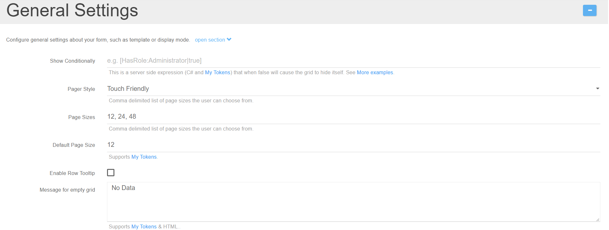
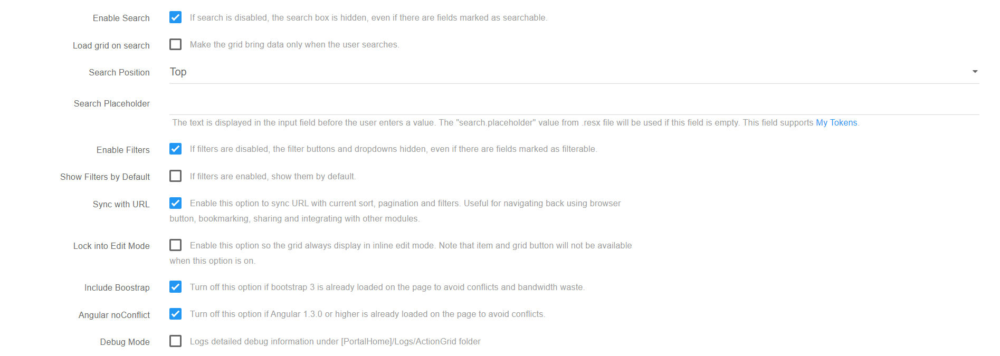

# General Settings

To sum up, the general settings allow you to configure the appearance of the grid.

These are the settings that can be modified:

* Show Conditionally
* Pager Style
* Page Sizes
* Default Page Size
* Debug Mode \(when checked, it will log detailed debug information under `[PortalHome]/Logs/ActionGrid` folder\)

The **General Settings** section is displayed for admins only and here you can configure the grid's display mode. Here are various options like the 



## Show Conditionally

This is a server side expression (C# and [My Tokens](/my-tokens/index.html)) that when false will cause the grid to hide itself. See [More examples](//action-grid.dnnsharp.com/conditions).

## Page style

From where you can choose if the page will be Touch friendly or Classic

## Page sizes

Option where you have the possibility to add other sizes by using the comma separator or to change the **Default Page Size** from 12 \(we've set this 12 default size because it's compatible with the 12 column grid system and we prefer to use this default size option\).

## Enable Row Tooltip

Enables an informative tooltip for end users.

## Message for empty grid

Is used for setting a message in case the datasource is empty.
  


## Enable Search and Enable Filters boxes

If they are not checked, then the search box and the filters will not be displayed on the grid even though there are fields marked as filterable or searchable.

## Load Grid on Search

This shows data only when the user types something into the search bar.

## Search Position  

Sets the position of the search bar. "Expandable" means that the search bar is smaller, but expands when in focus.

* The *Search Placeholder* is used to set a text that is shown when nothing is typed in the search bar.

## Sync with URL

This option syncs url with current settings.

## Lock into Edit Mode

This locks the grid into inline edit, so it's easier to edit the data inside if that's the only use a certain grid has.

## Angular noConflict and the Include Bootstrap

Options are checked by default, their purpose is to include their own versions of jQuery and Bootstrap libraries in order to avoid conflicts.

## Debug Mode

Logs detailed debug information under [PortalHome]/Logs/ActionGrid


## Select all position

If and where should a "Select All" checkbox appear.

## Root CSS Classes

Adds predefined CSS classes to the grid.

## Grid Row Selection

* This option is available under General Settings and comes enabled by default. Basically it enables the selection of grid rows when grid buttons are present.

**Warning:** If you disable this option your grid buttons can't have Per item or Final actions.

## Refresh when a modal/popup is closed

This option is available under General Settings and comes disabled by default. Use it to refresh Action Grid when a Bootstrap modal is closed. For example when using [Open in Pop option](buttons/special-buttons#TOC-Popups) the`afcallparentonsubmit=angridEditDone`parameter is no longer necessary.

## Grid minimum column width

If you would like to set a minimum column width in Action Grid, you can employ the following CSS:  

```css
div.angrid .angrid-row td:nth-child(7) {min-width:350px;!important}` \(this works in Chrome and IE9 +\)
```

and

```css
div.angrid .angrid-row td:first-child + td + td + td + td + td + td {min-width:350px;!important}` \(this works in IE8\)
```

## Create a list inside the PDF template

Right now the only way to create a list inside the PDF template is through My Tokens using a Razor token that loops over a SQL token. Example here:[my-tokens.dnnsharp.com/scripts-templates](https://my-tokens.dnnsharp.com/scripts-templates).


## Tabs Pro Integration

This option is available under the General Settings of Action Grid module and comes disabled by default. Basically it determines when the load/refresh operation should be done.

**Note:**These options are working only if you already have a [TabsPro](https://www.dnnsharp.com/dnn/modules/tabs-pro) version higher than 02.01.40 installed.

* **Load When Tab Is Activated -** this option enables Action Grid to be initialized when the tab is active;

* **Refresh Grid When Tab Is Activated -** this option enables Action Grid to be refreshed when the tab is active.


## Drag and Drop Actions

The Drag and Drop actions option provides the ability to perform certain actions after the position of a record from Action Grid is modified. It runs the set actions immediately after a drag and drop event.

The tokens below are generated and can be used later in actions:

* \[&lt;FieldName&gt;\] - contains all the corresponding data of the moved row; 
* \[prev:&lt;FieldName&gt;\] - contains all the corresponding data for the row situated above the moved row. 

The datasource information of the set Action Grid is not automatically updated to reflect the changes.

This option is available only in grid template.
