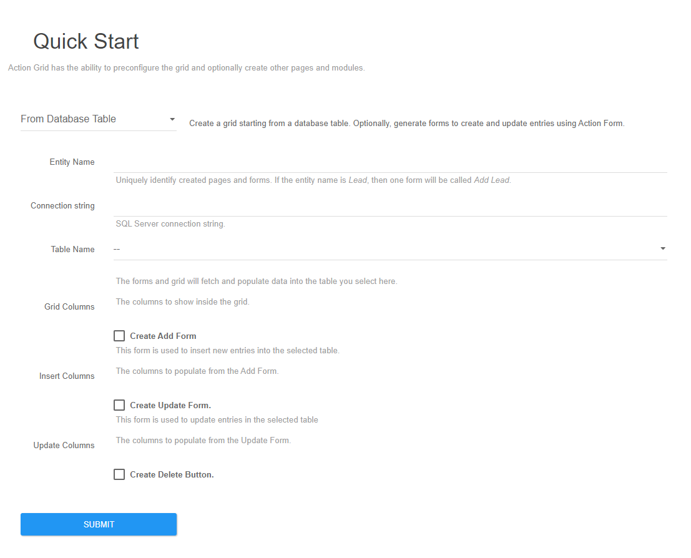

# Getting Started

## What is Action Grid?

Action Grid enables the integration of powerful tables from multiple sources into DNN projects, providing a simple, yet flexible mean of displaying data in a tabular format.

The table style of a data grid allows viewing data in a modern looking responsive table completed by headers, sorting, filtering, searching and more actions.

## Key Features

* **Seamlessly Integrated with Action Form**

  Action Grid enables the management of the submitted Action Form entries from different forms. It allows filtering, sorting, searching for records, editing or deleting records.

* **Manage Lots Of Data From Any Source**

   Action Grid allows displaying data in a tabular format out of the box from each of the following data sources: Action Form forms, Database table, SQL Query, Server Request(JSON), Credential Store. It’s also possible to add new custom data sources without needing the Action Grid source code.

* **Responsive and Touch Friendly**

  The most trending topics in web are with Action Grid. The data grid fits to any screen size and are swipe able on touch capable devices.

## How to Install Action Grid

In order to install Action Grid module on your DNN website, you can follow the steps below:

1. Begin by Logging into your DNN site with host account;

2. From the Persona Bar > Settings option select Extensions;

3. On the Extensions module menu, click on Install Extension Wizard button;

4. On the Upload New Extension Package page, click on Choose File button;

5. Select the Action Form package you previously downloaded on your hard drive, then click on Open;

6. Click on Next, accept the license, continue through the install. If all goes well, you will get a list of messages with "EndJob Installation Successful" at the bottom. When all is finished, click on Return button.

And that's pretty much all about the installation, the next step is to activate the module from production or if you try a demo, you have to unlock the trial for 30 days - these two options are displayed as a warning message at the bottom of the module after it was added on a page.

## Add Action Grid Module on your page

In the steps below, we are going to show you how to add a the Action Grid module on a page. 

1. When the page you work on is opened, select the Modules option from the bottom menu, click on the Add Module option.

2.Find avt.ActionGrid, click on it, and with Drag&Drop option add the module to your page.

3.Now that you have installed Action Grid Module on you page, you will need to configure it by clicking on Manage Grid option.

Important: Note that you will need to unlock the 30 Day trial or Activate for Production before you are able to see this screen.

## How to configure Action Grid

To manage Action Grid you have to access the management page of the module, either by clicking on the Manage Grid text displayed on the module after it was added on the page, either you have to click on the right edit menu on Manage Grid options.

First time when you click on Manage Grid you will be taken to the Action Grid Quick Start page. Here you will have to choose between the 2 "operating modes" of Action Grid:
 * Simple/Basic/Easy (from database table)
 * Complex (from scratch)
 
 
Choosing the simple mode (from Database Table) you will be taken to a page where you are able to:
- select the table you want to use as datasource for the grid
- select if you also want to automatically create ADD/UPDATE(edit) Forms and also a DELETE button on the Grid
- select the columns that will be part of the table and those that will be added/updated by using the automatically created forms
 

The complex mode (from scratch) will take you to the management page of the module, where you are presented with the following options, which are displayed and available for admins only: the [General Settings](general-settings.md) section, the [Data Source](data-sources/data-sources.html) section, the [Template](grid-template/index.html) section, the [Item Buttons and the Grid Buttons](buttons/index.html) section.

## Support

Our support staff is friendly and always available to help you. Engage us on our [community platform](//www.dnnsharp.com/Support#opturl=%2Faction-grid).
