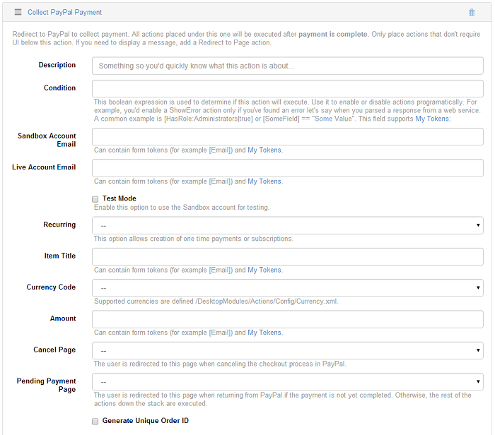

# Payments

## Collect PayPal Payment

Action Form allows you to set a PayPal payment requirement when the user submits the form. To set this requirement you will need to add the Collect Paypal Payment action. It allows you to set PayPal payments by submitting your Sandbox Account Email, Live Account Email, Payment Amount, Payment Frequency, and Currency preference. You can also apply tokens to the email addresses, item title and payment amount fields. 

The Collect Paypal Payment action allows you to set the requirement before giving the user access to specific resources or rights. When the users submits the form, they are redirected to the PayPal website, where they are able to complete the payment process. The user is required to log in to complete the payment process, but if he does not have a Paypal account, is required to open one.

* **Sandbox Account Email**

  The Sandbox Account Email field is used for entering your PayPal Sandbox email address. This is the email address you used when you set up your PayPal Sandbox account. Paypal Sandbox is a testing environment that allows you to test transactions without monetary transactions. You are required to enter a valid email address. If you do not enter a valid email you will get an error message.
* **Live Account Email**

  The Live Account Email field is used for entering your Live PayPal email address. This is the email address you used to open your Paypal account. If you do not enter a valid email you will get an error message.
* **Recurring Payment.** The Recurring Payment drop down menu includes a list of ongoing payment options:
  * Select None to require a recurring payment.
  * Select Monthly to specify a monthly recurring payment.
  * Select Yearly to specify a yearly recurring payment.
* **Item Title**

  The Item Title field is used for entering the title of the product or service. 
* **Currency Code**

  The Currency drop down menu is used for specifying your currency preference, for example U.S Dollars. The drop down menu includes a list of currency preferences, displayed in the list below. 
  * Select U.S. Dollars (USD) to specify U.S Dollars as the currency preference.
  * Select Euros (EUR) to specify Euros as the currency preference.
  * Select Canadian Dollars (CAD) to specify Canadian dollars as the currency preference
  * Select Pounds Sterling (GBP) to specify English pounds as the currency preference
  * Select Australian Dollar (AUD) to specify Australian dollars as the currency preference.
* **Amount**

  The Amount field is used for entering the amount for the product or service. You are required to enter a valid number. If you enter letters or symbols you will get an error message. Do not enter the dollar ($) symbol, this is invalid and will return an error message. Only numbers and decimal points are allowed, for example 5.55.
* **Cancel Page**

  The Cancel Page drop down menu includes a list of pages for redirecting the user when Cancel is selected. The list of pages in the Cancel Page menu depends on the pages available in your site.
* **Pending Payment Page**

  The Pending Payment Page drop down menu includes a list of pages for redirecting the user when the payment is pending. The list of pages in the Cancel Page menu depends on the pages available in your site.
* **Generate Unique Order ID**
  
  If you check this option box, an unique ID will be generated for each order the users makes.
  
## Payments without PayPal account

By default, PayPal requires customers that they either already have a PayPal account or create one during the checkout process. This option can be configured from PayPal so customers can buy without having a PayPal account, by using a credit card for example.
More information can be found [here](http://help.eventbrite.com/customer/portal/articles/430152-paypal-account-optional-setting).