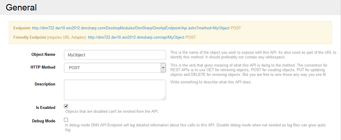
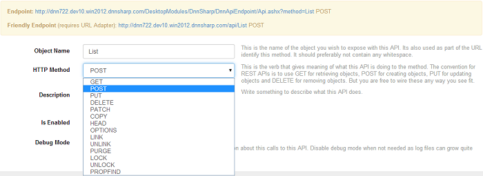

# API Methods

#### Summary

* an API method is an URL that is invoked with an HTTP verb
* API Methods can be used to execute server side logic (actions) or retrieve data
* DNN API Endpoint helps build REST APIs
* An API method is made of 3 parts: input, actions and a response

### What is an API

Used in the context of web development, an API is a set of HTTP request messages, along with a definition of the structure of response messages, which is usually in an XML or JSON format. According to www.rve.org.uk, "HTTP is a request/response protocol, which means your computer sends a request for some file (e.g. "Get me the file 'home.html'"), and the web server sends back a response ("Here's the file", followed by the file itself)."

### What is the purpose of HTTP

The HTTP is designed to enable communication between clients and servers and works as request-response protocol between a client and server. HTTP defines methods, which sometimes are referred to as verbs, to indicate and specify the desired action to be performed by the client on the identified resource, which corresponds to a file. The two most used HTTP methods are GET and POST. Normally, when you open a site, that's a GET. POST is usually when you submit a form.

### REST API

REST API is the underlying architectural principle of the web. The thing about the web is the fact that clients (browsers) and servers can interact in complex ways without the client knowing anything beforehand about the server and the resources it hosts. The key constraint is that the server and client must both agree on the media used, which in the case of the web is HTML. An API that adheres to the principles of REST does not require the client to know anything about the structure of the API. Rather, the server needs to provide whatever information the client needs to interact with the service. An HTML form is an example of this: The server specifies the location of the resource, and the required fields. The browser doesn't know in advance where to submit the information, and it doesn't know in advance what information to submit. Both forms of information are entirely supplied by the server. 

HTTP is oriented around verbs and resources. The two verbs in mainstream usage are GET and POST, which I think everyone will recognize. However, the HTTP standard defines several others such as PUT and DELETE. These verbs are then applied to resources, according to the instructions provided by the server.

* GET method is used to retrieve information from a specified resource;
* POST method submits data to be processed to a specified resource;
* PUT method replaces all the current data of the target resource with the uploaded content;
* DELETE method removes the specified resource.

### How to create a method in API DNN Endpoint

To create a method is very simple, first, you have to give the method a name - it will be exposed with the API and it will be also used as part of the URL to identify the created method. It should preferably not contain any white spaces. Then, you have to select the HTTP method you want to create from the drop down list displayed on the HTTP Method field. This field contains the verbs that give meaning of what this API is doing to the method. The convention for REST APIs is to use GET for retrieving objects, POST for creating objects, PUT for updating objects and DELETE for removing objects. But you are free to wire these any way you see fit. And as a last requirement, the Is Enabled box should be checked because the objects that are disabled can't be invoked from the API. 



All the methods accept as parameters and return them as properties and, they also accept and support tokens. These parameters which need to be fed into the API call, will be parsed under the given name and it will be possible to reference the fields using the [Token] syntax. If the HTTP method is GET, then the parameters are parsed from Query String, POST is read for form data fields. Every method has it's own particularities, so make sure to read HTTP specification as well.



You've already seen in the Getting Started section how a method can be created, now we're going to build something a little more complex using Action Form.

### Build an API on DNN with API Endpoint

To get to a more complex example where we can use the integration of API Endpoint with Action Form module, below you'll learn how to create some methods which will be invoked from Action Form server side from an HTTP request action and from client side from a button.

### Client side request from button

1. Begin by creating and naming a POST method (we need to output some text back), check the Is Enabled box.

2. Add a text parameter field in Input Data section and name it (this will be received via query string if it's a GET operation or via POST, in our case because the method we create is a POST method) - e.g Name

3. Next thing is to create an action which will be triggered by an HTTP request and which is executed in response to this invocation - we can add a Run SQL Query action in which add an SQL Select query (e.g. select '[Name]' as FirstName) and add an Extract Column box where Column Name = FirstName and Store As = FirstName. 

4. As response use the JSON Response where Name = Output and Value = [FirstName]. After you save the method, get back on the page.

5. Add the Action Form module on the page and select as option Blank Form where add a button, name it, and on Bind Expressions, on the section On Change/Click box add the HTTP request displayed in the sample jQuery code (in order to make an HTTP request to the URL displayed in the code):

```javascript
$.ajax({
type: "POST",
url: "//site.com/DesktopModules/DnnSharp/DnnApiEndpoint/Api.ashx?method=Print",
data: {"Name":"Test"} 
}).done(function( data ) {
// process response
});
```

6.Add a text box on the form, name it and get back on the button where you just have to put the name of the text box as a token on success in the code (when running on the client side, it gets replaced with a JavaScript variable which is bound to the text box) and after the token we'll put the Output from data because the HTTP request brings back a JSON that has an Output parameter :

``[Textbox] = data.Output;``

7.We also need to call a method called refresh which notifies manually that the data is refreshed and the UI should be updated because the request/method is not cached:

``refresh();``

8.And last, we need to set a

``return false;``

so that the button doesn't cause a post-back.

This is what the request from the button should finally look like: 

```javascript
$.ajax({
type: "POST",
url: "//site.com/DesktopModules/DnnSharp/DnnApiEndpoint/Api.ashx?method=Print",
data: {"Name":"Test"} 
}).done(function( data ) {
// process response
[Textbox] = data.Output; 
refresh(); 
});
return false;
```

9.The final step: check if this actually works - get back on the page and click on the created button.

The text which should be displayed in the text box at the click on the button action is brought from the API module, all of this worked client side and it worked from jQuery, it has the advantage of being called via Ajax, the page doesn't reload.

### Server side from HTTP request

For sensitive data which is not advised to be put on the web page because the jQuery calls are visible to the client browser and all the internal methods can be accessed and called by anyone. In these cases we need to make the call from server side. In order to create a server side request here's how we can manipulate the modules:

1. On the Action Form module create a new button with a distinct name in order to recognize that the action from it makes a server side request and add a On Click Handle action an HTTP request - a Server Request that makes a call to the Endpoint URL generated by the method.

2. In the URL box add the endpoint URL created by the method and in Post Data field add the data you want to retrieve (e.g. name=John) and set the HTTP method on the button as POST and set a store location by using the Output Token Name (e.g. [Name])

3. After the request is executed, we need to send back data to the browser and we can do it by adding on On Click Handler option the Update Form Data (AJAX) which will take everything that's in the context and passes back to the browser so the UI is refreshed. 

4. a small trick to get in the text box only the value and not the Output, you can add a Regex action on the button where the Input should be set in a token: [NameJson] to get a response from the HTTP request and store the data by setting in the Store in Token field the token (e.g. [Name]) and parse it using a Regex Pattern e.g. ``"Output"."(.*?)"`` - this Regex action matches the first subgroup which is used for storing into the Name token.

5. After saving these actions, get back on the page and click on the button which brings in the text box the output value from the request which is called from the DNN API module from server side.