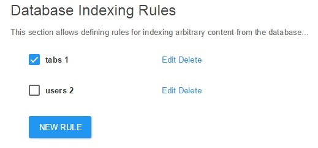
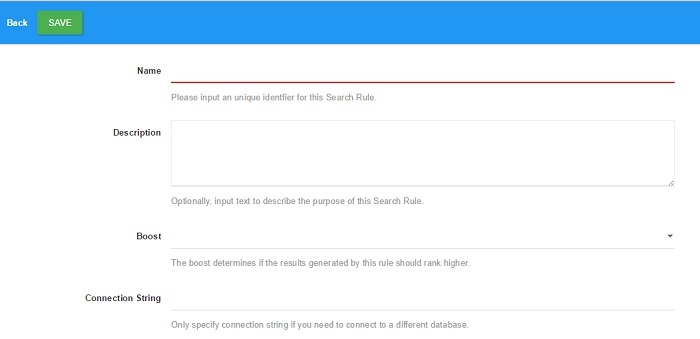
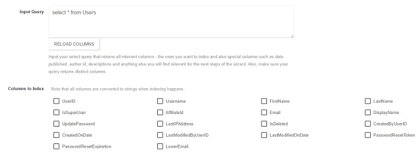
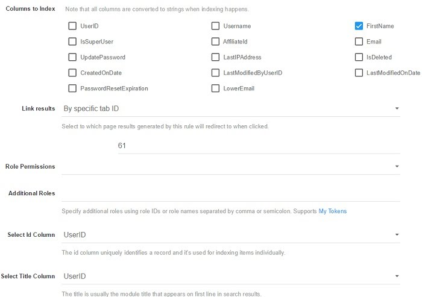

#### Custom Search Rules

Custom Search Rules allow you to define rules for indexing content directly from the database. Indexing rules are defined with queries and parameters. The rule is then used to search the database for specific content. The indexing rule is responsible for retrieving the content from the database and move it to the index.

**Create a Custom Search Rule**

1. To open Custom Search Rules click on the Search Settings link in the Manage menu of your avt.SearchBoost.Input Module. This link takes you to the Search Boost Control Panel.

2. From the Search Boost Control Panel go to Database Indexing Rules section then click on New Rule button.

3. The create rule page is opened which will collect general information, data queries, indexing rules and optional parameters. 


**Step1: General Information**

There are fields which collect basic information and parameters relevant to the search rule. You will need to input relevant data in the Title, Description, and Connection String fields. You will also need to choose a Boost parameter for the search. 

1. In the Title box Input the unique identifier. 

2. In the Description text field input a search description. 

3. In the Connection String field input a valid connection string if you would like to connect to a different database.

4. Then select a Boost parameter to determine how high you would like the results to rank.

**A General Information Example**

In this example search rules are created for users with user profiles. 

1. In the Title text box Users is entered as the unique identifier. 
2. Then Search for User Profiles is inputted in the Description text box to describe the purpose of the search.
3. No Boost is selected from the Boost drop down box to determine the rank for the search results.



**Step 2: Data Source**

1. Write your SQL query in the Input Query text field. Your query should specify all relevant columns for indexing, including all special columns and it should return distinct columns.

2. After completing the query use Reload Column button to load all the columns relevant to the table used in Input query. If error message is returned you need to correct the SQL statement before going to the next step. Errors are sent to the DotNetNuke LogViewer. 

3. If no errors are generated, then you can proceed to the next step by selecting the column(s) you need to use.



**Step 3: Indexing Rules**

Indexing Rules is the next step for creating a new index rule. This screen allows you to select columns that need to be indexed. Columns are converted to strings at the time of indexing. 

1. Specify the columns you want to index from the Select columns to Index list. 

2. Then scroll down to Link results to pages by using to specify where you want the page results to be generated when clicked.  You can manually input where you want the page results or select a specific column.
  * Module ID column allows you to redirect to original content when a link is clicked in search results.  Specify the Module ID column you want to use for redirecting to original content.
  * I'll specify a Module ID points to the module identified by the module id. Locate the Module ID and input it in the Module ID input field. You can use the next step below to pass additional parameters in the Query String.
  * Tab ID Column is similar to the Module Id column. It also allows you to redirect to original content when a link is clicked in search results. Specify the Tab ID column you want to use.
  * I'll specify a tab ID Column points to the page identified by this id. Locate the Tab ID and input it in the Tab ID input field. You can use the next step below to pass additional parameters in the Query String.
  * URL Column points to the URL specified by the database field. This option should be used with Advanced Query to build the URL from the database fields and predetermined data. Specify the URL column you want to use for the database field.
  * I'll specify a URL Column points to the URL specified in the this field. You can use the next step below to pass additional parameters in the Query String. You can use the following tokens in the URL:
    * [SearchItemId],[Type],[SubType],[ContainerPath],[ItemPath],[Title],[Description],[PortalId],[ModuleId],[AuthorId],[AuthorName],[DatePublished],[Custom<KeyName>]
    3.  Then specify the unique record for indexing individual items in the Select ID Column option. 

    4.  Then select Specify Title Column to specify the title column for the module that you want in the search    
         results.

    5.  When you are done click Next to go to final step.

An Indexing Rule Example

In this example specific columns are selected to be indexed, a tab id is inputted, an id column and a title column are specified for the search results.

 User.[FirstName] and User.[LastName] parameters are selected as the columns to index.

 I'll specify a tab ID option is specified in Link results and 61 is inputted as the tab ID for page results. Users.[UserID] is specified as the unique id in Select Id Column.
 
 
 

** Step 4: Optional Parameters**

The Optional Parameters screen allows you to provide specific details on how the rule is indexed. These parameters are optional. Specifying these parameters are not mandatory to establish a search rule.

1. Use Select Description Column to specify a short description for each result on the search page.

2. Use the Category section to broaden a search and filter results based on categories and subcategories. 

3. The AuthorID Column is an optional column. 

4. Select Publication Date Column if you have a Publication Date Field (also known as Date Created). 

5. Use the Additional Parameters section for selecting parameters from the database to search results through the Query String. 

6. In the And/Or manually provide parameters input text field specify additional parameters for example parameter1 = value1 & parameter2 = value2.

7. In the Parameters for XSL template section or Custom Data, select the parameters you want to send into the XSL template. You can access these parameters in the XSL template. Locate the result node with the value-of-select element that is responsible for extracting the parameters you send to the XSL template. 

8. Specify any additional data in the Manual Data field for example, parameter1 = value1 & parameter2 = value2.

9. When you are done specifying your optional parameters click Save.
10. 
**An Optional Parameters Example**

This example only selects the Users.[UserID] parameter from the Additional Parameters section. userid is then inputted in the text field as the parameter to pass. 


At this point the  process for creating a new search indexing rule is complete. All you need to do is save the rule and you will see it appears on the search settings page. You can Edit or Delete the rule if you want. 


You will now need to index your Custom Rule. To index your Custom Rule click on Index located on top menu of the Search Boost Control Panel. 


When the index is successfully completed you will see the Search Index Successfully Rebuilt message on the top right like in the image below. If you see this message, then your rule was successfully created.  


**Incremental Indexing
**

It is possible to setup a custom rule in such a way so it indexes only new content. This will greatly improve the indexer performance. Here are the rules that you must keep in mind: 
If you only have a published column, Search Boost is smart enough to pick up only entries added after last indexing operation. However, if entries are deleted they will still be present in search.

If you also have a IsDeleted column, and the "Last Modified" column changes when an item is logically deleted, Search Boost knows to also remove these items from the search index, if the last modified date is newer than the one indexed by Search Boost.


How to use Custom Data

1. create a rule to index in Files table in File Name column

2. access Custom Data > check Extension > set example in "pass as"

3. save > index

4. search for a keyword existing in File Name column, let's say "wink"

5. on the search result page append in the url: 

```page?sb-search=wink&sb-inst=418&sb-logid=136-0e86hr2rntycpauh&sbc-example=gif```

As expected result, "wink" result should be returned and displayed on SearchBoostResults - if you change the extension from gif to doc, no result should be displayed since there is no doc file with wink name in the File Name column.


