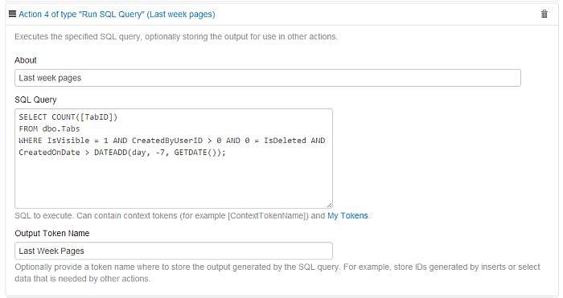
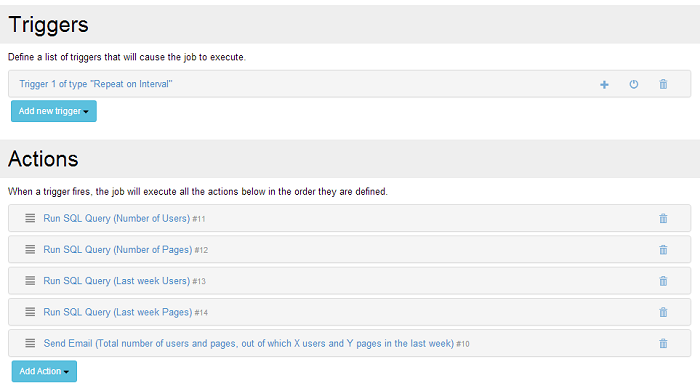

# Examples

**1. Delete files older than one month (31 days) from a given folder**

We create a new job in the [Jobs](jobs.html) administrative page. A [trigger](triggers/time-triggers.html) is needed to schedule this job and for this maintenance task, a monthly frequency seems often enough, so we add a "Repeat on interval" trigger with the interval set to 14 days. Twice a month we will delete the files that are older than a month. Now we need some [actions](actions/actions.html) to get the job done. We will use a [PowerShell script](actions/run-powershell-script.html) since it is the more generic (the folder is not necessary related to DNN) and a powerful (we can use the .NET functionality) method, but other methods are also possible (some custom executable or defined method). So we add a "Run PowerShell Script" action with the following script:

**WARNING!**  Please be sure you know what you are doing, the script will really delete those files!

```powershell
function RemoveFiles($path = $pwd) 
{ 
    [hashtable]$Return = @{} 
    $Return.files = 0
    
    foreach ($item in Get-ChildItem $path) {
        if (Test-Path $item.FullName -PathType Container) {
            $filesIn = RemoveFiles $item.FullName
            $Return.files += $filesIn.files
        } 
        else { 
            $limit = (Get-Date).AddDays(-31)
            if ($item.LastWriteTime -lt $limit) {
                 Remove-Item $item.FullName
            }
            else {
                $Return.files += 1
            }
        }
    }
     
    # also remove empty folders
    if ($Return.files -eq 0) {
        #Here the -force option will delete hidden and system files.
        #recurse needed to avoid confirmation dialog
        Remove-Item $path -force -recurse
    }
        
    return $Return
}
RemoveFiles("C:\Logs")
```

This script will remove recursively the files older than 31 days from the folder "C:\Logs" (change it to your location), including the folders left empty. Being run from the IIS service, if not inside the host folder, be sure you have the appropriate rights for the application, that is "full control" for the "Network Service" user.

**2. Send email notification once a week with total number of users and pages, out of which X users and Y pages in the last week**

After creating the job in the [Jobs](jobs.html) page, we need to add a [trigger](triggers/time-triggers.html) and it is "Repeat on interval" we choose, with a 7 days interval to run it on a weekly basis. We find the number of users and pages by querying the database, so the obvious [action](actions/actions.html) is "[Run SQL Query](actions/run-sql-query.html)", but one script will not be enough since the script will be complex enough and since we need four "Output tokens": total number of users, total number of pages, new users during the last week, new pages during the last week, respectively. The needed scripts for these tokens (and the four actions):

```sql
1. SELECT COUNT(UserID) FROM dbo.Users;
2. SELECT COUNT([TabID]) FROM dbo.Tabs WHERE IsVisible = 1 AND CreatedByUserID > 0 AND 0 = IsDeleted;
3. SELECT COUNT(UserID) FROM dbo.Users WHERE CreatedOnDate > DATEADD(day, -7, GETDATE());
4. SELECT COUNT([TabID]) FROM dbo.Tabs WHERE IsVisible = 1 AND CreatedByUserID > 0 AND 0 = IsDeleted AND CreatedOnDate > DATEADD(day, -7, GETDATE());
```

The final action will look like in the following image:



Now we add a "Send Email" action for the report. We can use a Subject like "Last week users and pages report: ``[Last Week Users] ([Total Users])`` users, ``[Last Week Pages] ([Total Pages])`` pages" and a body like "You have ``[Total Users]`` users and ``[Total Pages]`` pages on your portals, out of which ``[Last Week Users]`` users and ``[Last Week Pages]`` pages last week.". See how the output tokens were used!

The final job we'll look like this:


