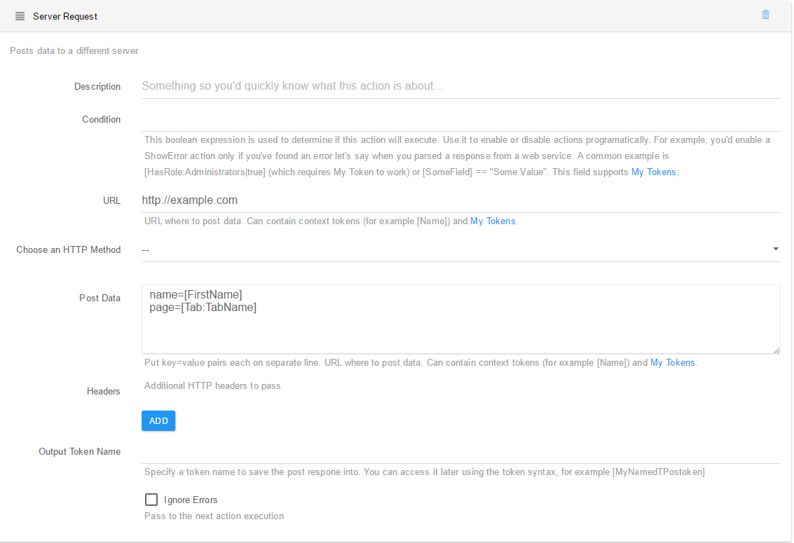

# Post Data

The *Server Request* action can be used to make an HTTP request to a different server, optionally sending data. Oftentimes, this means invoking a web service. Note that if you don’t run in Full Trust, this action requires that the Application Pool identity have Web Permission. The following fields can be configured: 

**URL**. This represents the URL to make the request to. A common mistake is to forget to include the protocol. For example, www.domain.com/webservice is wrong. Instead, use http://www.domain.com/webservice. Optionally, append the query string directly to the URL after the question mark. For example, http://www.domain.com/websservice?q=test&p=1. This field supports context tokens and My Tokens.

**POST Data**. This is data to send to the URL using the POST operation. Set key=value pairs, each on a separate line. It’s also possible to post entire messages and XML (that SOAP-like services expect) by simply adding the XML without any lines. This field supports context tokens and My Tokens.

