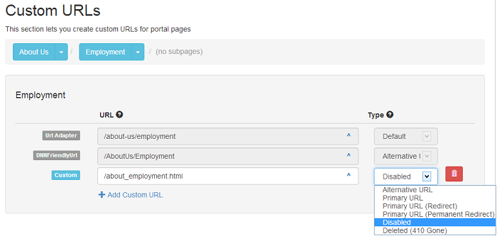

# Redirect HTML Pages

In this example we are going to show you how simple is to redirect old .html pages to the new DNN ones. Note that you can do like this with all other page types (extensions).

So, if you have a list of old HTML pages that you want to redirect to the new DNN pages, follow the next instructions:

In Custom URLs, go to your new page to see the existing aliases. We have the following:
* URL Adapter: `/about-us/employment` -- Default
* DNNFriendlyUrl: `/AboutUs/Employment` -- Alternative URL

We're going to redirect the old page `/about_employment.html` to the new page `/about-us/employment` just by adding to the Custom URL `/about_employment.html`, and set it to "Disabled". This tells the old "Disabled" `.html` page to go to the "Default" page. Be carefully to add the extension type for the Custom URL.

That's it! It's just that simple. You can do like this with all the pages you want to redirect.

Also note that in certain cases, prior IIS7, you will need to map `.html` extensions to be handled by the ASP.NET handler. Without this, IIS will throw the 404 page not found and never pass execution to URL Adapter.

If you do not have access to the IIS Manager you can add in `web.config` (configuration > system.webServer > handlers) the following line:

    <add name="URLAdapter-handleHtml" path="*.html" verb="*" type="System.Web.UI.PageHandlerFactory" preCondition="integratedMode" />
    
The name of the handler must start with `URLAdapter-`, otherwise URL Adapter will ignore it.

Watch [this youtube video](https://www.youtube.com/watch?v=mYc1VVNxmp0){:target="_blank"} to see more on how to redirect `.html` pages to DNN. 